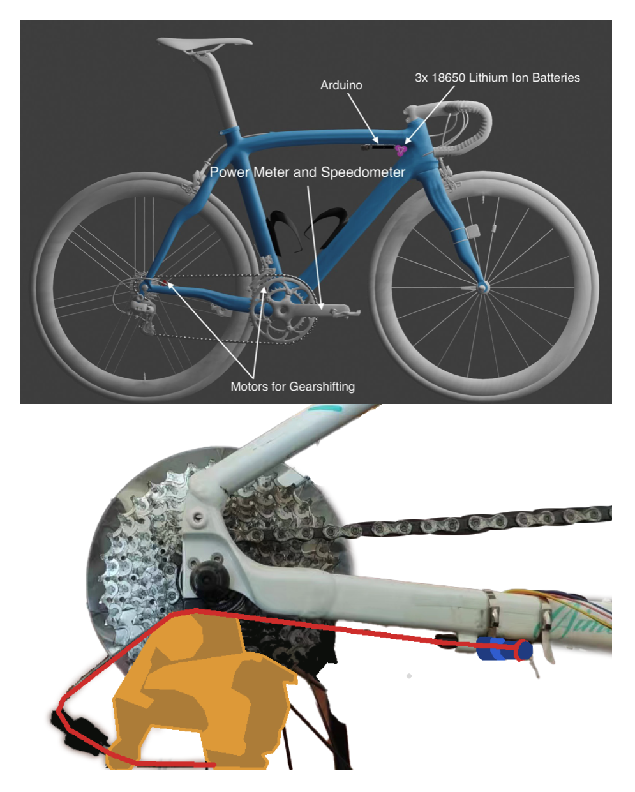

# A Data-Driven Approach to Optimizing Non-EBike Acceleration through Gear Ratio Optimization

[paper pdf link](paper.pdf)  
Currently publishing to JEI (Journal of Emerging Investigators)  

## Abstract

Bikes with derailleurs use a complex mechanism to convert pedaling into acceleration. While it is commonly believed that higher gears accelerate bikes faster, the best gear-switching strategy for maximum acceleration remains debated. Many products claim to optimize gear shifting for acceleration, but their functioning and data are not publicly available. We developed an automated system\* interacting with derailleurs to investigate this. Our system significantly increased acceleration by 221.9% compared to using the highest gear as a control. However, our system underperformed manual transmission due to limited resources. Despite this, our findings indicate that optimal automated bike gear shifting significantly impacts acceleration. Although our system is not as efficient as manual transmission, we've shed light on this opaque area with our model, methodology, and significant results.

## Keywords

Robotics and Intelligent Machines; Cognitive Systems; Engineering Mechanics; Ground Vehicle Engineering

## Introduction

Along with the development of modern technologies, came an increased global attention on its impacts on climate change. The most widely advocated section of such includes automobiles, which released around 3 billion metric tons of carbon dioxide into the atmosphere in 2020.1 Not only that, with the development of countries, people often exercise less, resulting in greater health issues. Biking, being a method of commuting and a form of exercise, combines both aspects of the issue. However, being relatively slow, it might not be practical for most people. As a result, in our project, we built an automatic gear shifting system that could enhance the acceleration and cruising speed performance of an average bike, that would incentivize more people to use it for commuting.

Figure 1: Power curve comparison between sports cars2 (left) and bikes3 (page 98) (right). 

 

In developing the product, we have found a lot of alternative solutions to automatic gear shifting, from Shimano, Cambridge Consultant, and Peyman, among many others. The Shimano Di2 SyncroShift is an electronic shifting system that allows bikers to shift without pedaling by utilizing a chainring coupled to a drive unit to power the shifting of the gears. It is available on bikes with EP600 and EP801 drivetrain.4 Cambridge Consultant’s Connected Bike uses Bluetooth to connect a mobile device to the bike, enabling features such as automatic gear shifting.5 Peyman’s fully automatic mechanical continuous variable transmission (CVT) variation system enables smooth acceleration and higher speeds and is lightweight and durable.6

Despite the numerous existing commercial products, no data was available on the efficiency improvement of their product. Thus, this paper is aimed at developing a system and to explore the effects of efficient gear-shifting on bicycles. Our goal is to improve the transparency of data regarding our question, which as aforementioned, is often undisclosed by companies.

For our own product, which was continued from both ISEF and Genius Olympiad, we hypothesize that due to biking’s similar variable power curve to internal combustion vehicles (Figure 1), a similar concept of gear-switching to cars can be used to improve power efficiency in bicycles.

## Methods

To explore the potential impact of an automated gear-shifting system on bikes, we first gauged the effects that manual shifting had on acceleration to obtain a point of comparison.

To prove the significance of the similar power curves and our hypothesis, we conducted an experiment in which we compared the acceleration with and without gear-shifting. Through the test, we found that shifting gears increased acceleration by 221.9 percent, a statistically significant result.

Figure 2. A map of the biking trip and the OCR process to obtain raw data. 

 

Therefore, optimal gear shifting patterns could similarly aid in the acceleration and cruising speed of biking.

We screen-recorded the Giant connect app, which showed cadence, power, and speed during a biking trip around Shanghai that lasted 23 minutes, which included acceleration, cruising, and deceleration, which would provide data about different kinds of biking (Figure 2). We chose to screen-record the data from the app rather than directly extract the data because the Garmin app’s exported data is inaccurate (e.g., showing the velocity as zero when the bike was moving). Each video frame was then converted to gray scale, binarized, and then scaled to twice its original size (Figure 2). We then sliced sections of the frame to match the location of the datapoints and converted the slices to text through PyTesseract.7 We further preprocessed the data by configuring PyTesseract to recognize English, using a page segmentation mode (PSM) of 6 (assume a single uniform block of text), using OCR engine mode 3, and applying a character white list of “0123456789.”7 This preprocessing ensured that all our data points were numbers. From these data points, it is all plotted onto a graph where a regression will be extrapolated, which would be the power curve. The power curve would then be put into an algorithm to simulate an environment and predict losses to find the best gear ratio. More specifically, we took the variables of speed and cadence to calculate the acceleration, which was then used to calculate environment loss variables such as air friction and rolling friction. A neural network (Figure 3) was then applied to learn patterns in our data to find gear ratios that minimized power lost to environmental losses and maximized acceleration.

Figure 3. Neural network algorithm and two formulas used to simulate a biking environment. 

 

However, since the neural networks learn and optimize patterns, it could automatically switch to the gears we would have switched to already; it would never find the best gear ratios to switch to. Additionally, a significant factor that increases the margin of error in this system is that when predicting the power lost to the environment, we are using equations that apply to theoretical environments to estimate real-life situations, which also does not consider other losses such as the wind direction and the material of the road. Below are some of the equations that we used (Formula 1 and Formula 2).

Figure 4. First virtual model and physical model (red = transmission cable; blue = 28byj48 stepper motor; orange = gear shifting assembly). 

 

For our second solution, we added a Magene power meter to our bike so we could collect data on power as well. Having a single data point representing power eliminates much of the complexity and inaccuracy of predicting the wattage from the variables of speed and cadence, which is the method we used in iteration one; this single value can take into account many factors’ impacts on our system, from the user’s weight to the aerodynamic drag they experience, which significantly simplifies the data points we previously had (Figure 4).

We first made a virtual Blender model to plan our physical model’s required materials and design (Figure 4).

We then built the virtual model onto a physical model with the Aimez SL1 bike from Giant. The motors connected to a 12-volt lithium-ion battery would pull the cables to different tensions to execute the algorithm’s decisions (Figure 4). Additionally, an Arduino was used to carry out the algorithm for the bike to know which gear to switch to. Finally, the user would ride, and the bike would shift its gears.

As for the data collection for the calibration of the biking system, we collected data using the Giant Connect app. We took five screen-recorded videos, each under 1 minute, of the app accelerating from a standstill. The 3 data points were speed, cadence (RPM), and power (measured in watts). We then used Tesseract OCR to read the datapoint inputs from our video data (Figure 2), as the raw exported .gpx and .tcx files from Garmin Connect were not as accurate as the on-screen display.7 When the product is in normal use, the phone would have the appropriate apps to display the three data points and then broadcast its screen to the laptop to extract the numbers. The computer would then process the numbers with our algorithm and communicate to the Arduino to execute the gear shifts, ensuring the bike was on the optimal gear ratio.

Figure 5. Our algorithm’s system block design, including the torque graph (blue: datapoints; red: best-fit polynomial regression) and the L298N DC motor driver schematic to execute our gear changes.10 

 

For the data processing of the information in this iteration, the three data points are put through a ten-degree polynomial to obtain a torque curve (Figure 5).9 The decision regarding gear shifting which would be made regarding these data points is given by Physics for Gearheads by Randy Beikmann, which links the engine’s torque output to the engine’s rpm. Within the book, he introduces the idea that after shifting gears ...

1. If the torque output of a car at a given speed is less than that of the engine’s maximum rpm, then shifting at the engine’s maximum rpm would be more efficient;

2. If the current and next torques are equal, or by shifting the gear up, the torque would increase, then shifting before the engine reaches maximum rpm would be more efficient.

Thus, by entering any speed and cadence into the algorithm, it would decide whether to upshift, downshift, or not shift based on ...

1. If |current gear ratio × current torque − upshift gear ratio × upshift torque| < 3 (meaning the two products are around the same with a margin of error of three), then the decision is to upshift;

2. If downshift rpm < 150 (the maximum RPM we have measured from our data), then the decision is to downshift;

The computer then communicates with the Arduino via Pyfirmata to power the motors to shift the gears via the schematic in (Figure 5).9 Therefore, through this process, when it is fed the speed, cadence, and watts, this algorithm would output a decision for gear shifting.

However, for this iteration, we realized that the motors were not powerful enough, since putting the motors directly on the wire would mean that it is constantly pulling against the spring in the derailure. Not only that, we needed a method to send the data from the sensors to the Arduino. We also found that controlling the transmission wire would require an expensive, high-torque motor and a nuanced control system for clutching the wire and pulling it to the appropriate lengths.

Figure 6. Second virtual model (blue: motor assembly, yellow: Arduino UNO, magenta: battery storage, red: power sensor, green: laptop) and subsequent physical model (1. motor assembly, 2. motor driver, 3. battery, 4. Arduino UNO, 5. laptop, 6. power sensor, 7. phone). 

 

Learning from the shortcomings of our first physical model, we designed a new virtual prototype in Blender (Figure 6) with the motors attached to the handlebar instead of near the rear derailleur. This system offers better control of the gears as all the motors have to do is pull the levers instead of calculating how much to pull and clutch the cable to shift gears and maintain gears. We then built the physical model (Figure 6).

Figure 7. Acceleration testing data, means, standard deviations, 95% confidence intervals, and graph comparing the statistical significance of our acceleration with no gear shift, automatic gear shift, and manual gear shift (blue: ISEF results, red: Genius Olympiad results). 

 

For the data collection, we tested three conditions—accelerating on the maximum gear ratio of 4.73, accelerating with our algorithm, and accelerating with manual gear shifting — each with five trials to minimize the impacts of any trial that is an outlier — see Figure 7. Our control group is accelerating on the maximum gear ratio of 4.73. The controlled variables were the person biking, the distance we timed, and the timing method. To ensure that the person biking did not tire over time, we allowed them ample time to rest between each trial. We biked over the same stretch of road of 159 meters. The timing method was the biker starting from a standstill and starting to pedal when the timer flashed the flashlight and began the stopwatch. When the biker crossed the 159-meter mark, the timer stopped the stopwatch.

After collecting the data, we used basic kinematic equations and the final speed reached to calculate the bike’s acceleration between the two points, thereby showing the significance of the results. The significance of the results is then created by calculating the standard deviation of the data set we have collected. We calculated a range of two standard deviations, representing the 95 percent confidence interval. Once the two ranges, the assisted gear shifting and the acceleration on the maximum gear ratio, do not overlap, we can determine that the results are statistically significant. We also compared the percentage increase with the manual gear shifting we tested to determine the actual significance of our product in real-world applications.

The problem with this iteration is that the model needs to be improved speed-wise as the gear switching time is around 0.9 seconds, much slower than manually doing so. For the algorithm, we assumed that the ruleset from Physics for Gearheads is the best; however, there could be a better one out there that is more suited to our specific biking format.

For our current iteration of the solution, we incorporated the idea of artificial intelligence from our first iteration with the physical model we created.

However, this time, we propose reinforcement learning instead of a plain AI that can only recognize patterns in our biking style so we can genuinely achieve optimal gear-shifting patterns. Furthermore, this new model should avoid the problem of the previous model’s ruleset’s rigidity, potentially allowing it to find patterns not addressed by the ruleset.

For our model architecture, we use a long short term memory (LSTM) layer with 128 internal units, then dense layers to reduce the shape of the output down to eventually 3, which is the action size containing the three actions of upshift, downshift, and maintain.11 We gradually reduced the shape of the output to avoid potential problems with the massive jump from a shape size of 128 to 3. Furthermore, we used an LSTM instead of a gated recurrent unit (GRU) or a simple recurrent neural network (simpleRNN) because the LSTM has more tunable parameters, which would make our algorithm better fitted.12-13

For the environment of our reinforcement learning model, the state set is obtained not through random generation but through the extracted data points from the screen broadcast. The environment’s step function takes an action, executes it, and calculates the reward, which is the change in speed due to the gear change action it executes.

For the agent of our model, we use a learning rate of 0.001, a gamma value of 0.99 which puts more weight on long-term rewards, an epsilon value of 1.0, and an epsilon decay value of 0.9995, which works to control the balance between the algorithm’s exploration rate and exploitation of knowledge it already has (stored in the q values).13 The agent’s actions are based on the epsilon values, and the agent chooses between the three aforementioned possible actions. The agent also uses replay buffers to further train on the agent’s memories and learn from its past.14

The limits of our newest algorithm model still need to be tested, and common reinforcement learning flaws can be adjusted for during the testing phase of this iteration.

## Results

The raw data that we have collected can be seen in Figure 2. With our raw data, we then calculated the mean, standard deviation, and the 95% confidence intervals to determine statistical significance, and compare the effectiveness between different models of our gear shifting system (Figure 7). Our data shows that our system is around 2.13 times better than accelerating on the maximum gear ratio, while manual shifting is 2.67 times better than accelerating on the maximum gear ratio (Figure 7).

Our solution was ultimately successful because the project had significantly improved over the past iteration. In our ISEF research project (marked by the blue labels in Figure 7), our solution had an 111% acceleration increase over baseline 1. However, now, our solution has a 154.71% increase over the baseline (marked by the red labels in Figure 7). Most importantly, while our previous iteration was not statistically significant, as seen through the overlapping 95%-confidence intervals, our current model is, as seen through the separate 95%-confidence intervals of our solution and the baseline (the leftmost two red-labeled curves in Figure 7).

Of course, between the testing for the two iterations, the difference between the manual and no gear shifting is much greater on the second one than the first. On our second iteration, the acceleration is nearly 211.8% instead of 104.7%. Even when taking the different maximum percentages into account, our old results only utilize up to 54% of the available potential with manual gear shifting while our current model utilizes up to 73% of the available efficiency gains. As a result, we have substantially improved our old model.

Table 1. Proposed benchmarking system. 

 

For standardizing and assessing a benchmark for comparing different products, we have established a benchmark that assesses the effectiveness of not only our solution but also other people’s and future solutions so that the solutions in this realm can be adequately compared. The benchmark is the percentage increase in acceleration of the proposed solution based on acceleration at the bike’s maximum gear ratio, which in our case was 4.73 — see Figure 7. The effectiveness of our current results are based upon this benchmark.

## Discussion

Through the many iterations that we have made, there are certainly a lot of improvements that can be made with our current product.

For our algorithm, more dimensions, or parameters can be added for the algorithm to be better trained. Testing different regression models, where we will test for their accuracy, can provide us with a more comprehensive understanding of which regression model best fits our data, potentially increasing the effectiveness of our torque graph, since we would have a more accurate understanding of how the RPM affects the torque. Not only that, after polishing and tuning the reinforcement learning model we could also later implement it into our physical model. For fine tuning, we can tune our variables and network configurations to the most optimal ones for the resulting acceleration.13 For implementation, we need to train our model to a point where it exceeds our current algorithm's acceleration improvement, and then we would have to conduct testing.

As for the physical product, a gearbox, which would speed up the rate at which a gear is switched, could be implemented to enhance the responsiveness of the gear shifting. This could also enhance our AI training model, since less variables would go into the process of gear shifting. Not only that, for the physical product, we can also improve the compactness and safety of our solution to progress our project into a more finalized product. Currently, the user would need to wear an extra backpack to contain a laptop to communicate with the Arduino, contributing to an overall irritating user experience. We can resolve this issue by using a Raspberry Pi to drive the whole system instead of a laptop. An improvement could also be made for the transmission from the motors to the gear switching levers. Although we already used a stiffer method of pulling the gear levers—metal cables as opposed to our previous plastic string, there is a significant amount of elasticity in those metal cables, which often absorbs some of the slack by coiling up, leading to difficulty executing multiple gear changes consecutively without having to adjust the tension of the cable. A cable with less elasticity can be used to increase the physical integrity of our system and the duration our system can function without maintenance.

The product also needs a significant improvement in terms of its cost. We can assess the effects of removing the input variable of wattage, which would reduce the e can assess the effects of removing the input variable of wattage, which would reduce the cost by the cost of the power meter—the main contributor (around 1700 RMB) to our high price of around 3000 RMB right now, by comparing its accuracy with our current accuracy. If there is no significant impact on the accuracy, we can remove the power meter and significantly reduce the cost of our product.

Additionally, for the increased accuracy for our test results, we should have a wider sample of people to test the acceleration from. We are currently testing our product on ourselves, which may lead to results influenced by researcher bias; additionally, as we are more experienced in biking, we may not be the best test subjects. Different bikes should also be used, to eliminate the noise that can be caused by such a variance.

## Conclusion

Within the relevant literature we have looked at, very little has discussed the potential impacts and implications of their solutions. We have explored our research question on the effect of automated bike gear shifting on acceleration, which was previously a black box with large corporations not disclosing their data and findings. Even though our system is worse than manual transmission because we do not have a corporate-level team working on this, we have added transparency to this black box through our model, methodology, and statistically significant results.

One possible application of our findings is that it could be commercialized to increase the general public’s gear-shifting speeds, making biking a more efficient commute option.

## Acknowledgements

We want to thank Mr. Ian Miller, for reviewing our work and allocating us the robotics parts that made this project possible.

## References

1. Statista. (n.d.). Carbon dioxide emissions in passenger transport worldwide from 2000 to 2018 (in million metric tons). Retrieved [insert date], from https://www.statista.com/statistics/1107970/carbon-dioxide-emissions-passenger-transport/

2. S. Bhosle, “ENGINE SIZING AND TRANSMISSIONS – sports car,” 2014.

3. D. G. Wilson and T. Schmidt, Bicycling Science. The MIT Press, London, England: MIT Press, 4 ed., May 2020.

4. D. Rome, “Shimano introduces automatic di2 shifting.” https://cyclingtips.com/2022/07/shimano-introduces-automatic-di2-shifting/, July 2022. Accessed: 2023-3-1.

5. P. Williamson, “The connected bike that helps you ride smarter.” https://www.huffingtonpost.co.uk/paul-williamson/cycling-bluetooth-connected-bike_b_2811033.html, Mar. 2013. Accessed: 2023-3-1.

6. “Fully automatic mechanical CVT variator system for bicycles.” https://www.bike-eu.com/41087/fully-automatic-mechanical-cvt-variator-system-for-bicycles, Aug. 2021. Accessed: 2023-3-1.

7. M. Brisinello, R. Grbic, M. Pul, and T. Andelic, “Improving optical character recognition performance for low quality images,” in 2017 International Symposium ELMAR, IEEE, Sept. 2017.

8. M. N. O. Manipon and https://orcid.org/0000-0003-0104-5465, neorico27.mnm@gmail.com, Saint Mary’s University, Philippines, “Effectiveness of ChemiCooking as a gamified intervention in nomenclature of compounds: Learning experiences of grade 11 students in a public school,” International Multidisciplinary Research Journal, vol. 5, Feb. 2023.

9. R. Python, “Arduino with python: How to get started.” https://realpython.com/arduino-python/, Oct. 2019. Accessed: 2023-3-1.

10. Swagatam, “L298N DC motor driver module explained.” https://www.homemade-circuits.com/l298n-dc-motor-driver-module-explained/, Sept. 2017. Accessed: 2023-3-1.

11. S. Zhu and F. Chollet, Working with RNNs. Keras. Retrieved March. 2019.

12. S. Rathor, “Simple RNN vs GRU vs LSTM :- difference lies in more flexible control.” https://medium.com/@saurabh. rathor092/simple-rnn-vs-gru-vs-lstm-difference-lies-in-more-flexible-control-5f33e07b1e57, June 2018. Accessed: 2023-3-1.

13. H. Pedamallu, “RNN vs GRU vs LSTM.” https://medium.com/analytics-vidhya/rnn-vs-gru-vs-lstm-863b0b7b1573, Nov. 2020. Accessed: 2023-3-1.

14. R. S. Sutton and A. G. Barto, “Reinforcement learning: An introduction,” IEEE Trans. Neural Netw., vol. 9, pp. 1054–1054, Sept. 1998.

15. T. Schaul, J. Quan, I. Antonoglou, and D. Silver, “Prioritized experience replay,” Nov. 2015.
